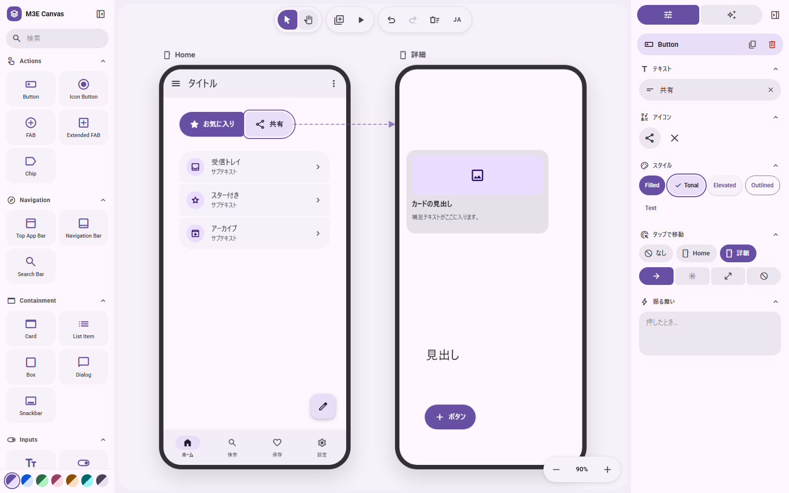
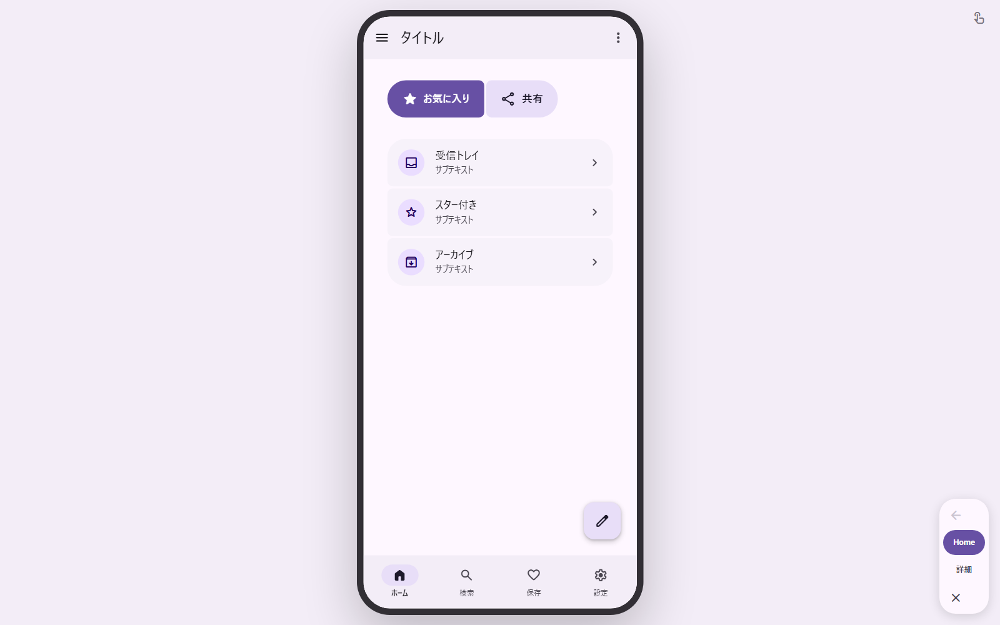
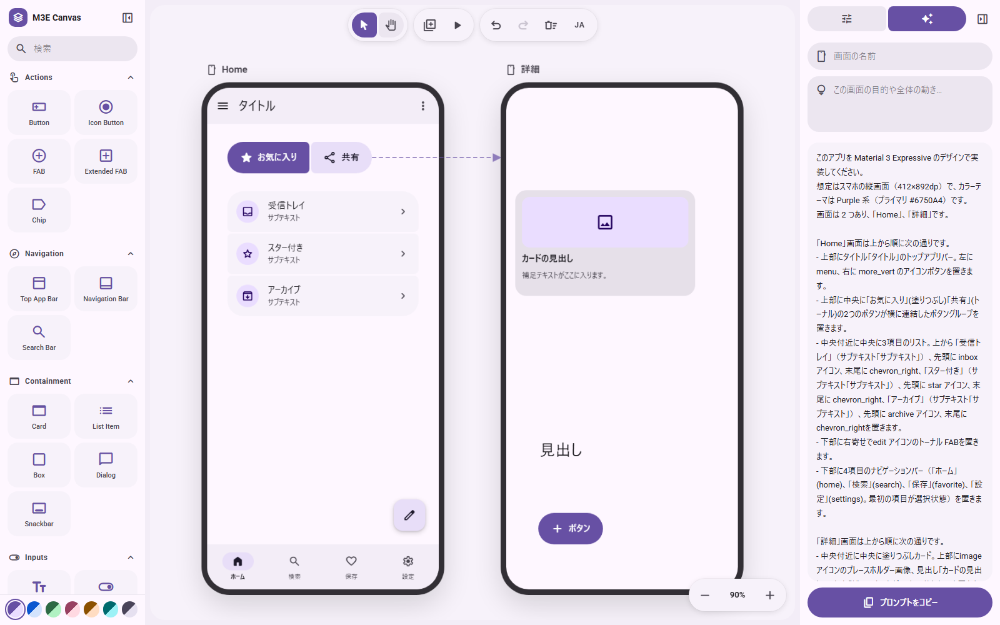
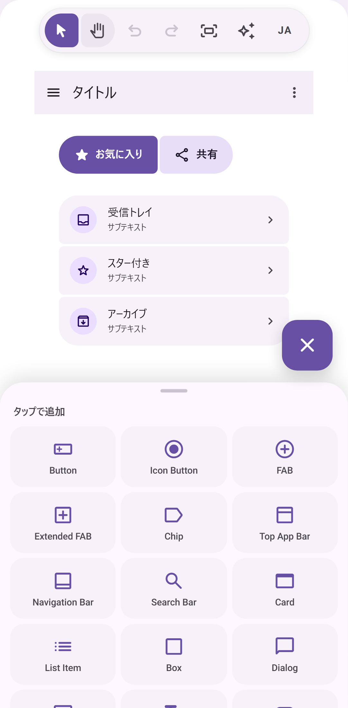

<p align="center">
  
</p>

<h1 align="center">M3E Canvas</h1>

<p align="center">
  <strong>Sketch Material 3 Expressive screens in the browser, link them, tap through them, and copy a prompt for your AI coding tool.</strong>
</p>

<p align="center">
  <a href="https://lnkiai.github.io/m3e-canvas/"></a>
  <a href="https://github.com/lnkiai/m3e-canvas/actions/workflows/deploy.yml"></a>
  <a href="LICENSE"></a>
  
  
  
  
</p>

<p align="center">
  <a href="#日本語">日本語</a> · <a href="#中文">中文</a> · <a href="https://lnkiai.github.io/m3e-canvas/">Open the app</a>
</p>



## What it does

- **Drag-and-drop parts** – buttons, icon buttons, FABs, split buttons, FAB menus, chips, app bars, navigation bars, floating toolbars, tabs, search bars, cards, lists, dialogs, snackbars, text fields, switches, checkboxes, radio buttons, sliders, text, images, badges, boxes and dividers, all drawn to Material 3 Expressive.
- **Magnetic connections** – bring two buttons or list items close and they fuse into a connected group; the corners soften as they meet.
- **Real M3 Expressive loading** – the shape-morphing Loading Indicator (ported from material-components-android) and wavy linear / circular progress indicators.
- **Phone screens** – add as many screens as you like, name them, pick a background, and drag a screen to move everything on it.
- **Tap to navigate** – give any tappable part, an app bar icon or a navigation bar destination a target screen (or "back") and a transition: slide from any of the four sides, fade, expand or none. Arrows show the flow on the canvas; the preview lets you tap through it, and back plays the transition in reverse.
- **Swipe to navigate** – a screen can open another on a left / right / up / down swipe. In the preview the screen follows your finger, and the reverse swipe goes back.
- **Toggle buttons** – any button can flip on tap, changing its icon and style.
- **Layers and groups** – a layers panel lists the z-order of each screen; drag or use the arrows to bring parts forward or send them back. Select several parts and group them to keep their overlap and move them as one. The prompt describes overlaps and side-by-side rows explicitly so the generated layout keeps them.
- **Theme** – the four M3 Expressive axes in one panel. Color: seven presets or one seed color that becomes a full Material 3 scheme you can fine-tune, light / dark, three contrast levels and a dynamic-color switch (match the phone wallpaper). Shape: square, rounded or full corners for every part at once. Type: Roboto, Roboto Flex, Roboto Serif or the system font, with the emphasized styles. Motion: the standard or the expressive spring scheme, which also drives the preview.
- **Prompt output** – the whole design (or a single screen) becomes a concise natural-language prompt in Japanese, English or Chinese, including your own notes on what each part does.
- **Export** – copy the prompt or save a screen as a PNG.
- **Alignment guides**, undo/redo, keyboard shortcuts, seven color themes, a favorites row in the parts panel, and everything is saved in your browser (localStorage).
- **Phone-friendly** – on a phone you get one fixed screen and a buttons-only editor: tap the plus to add a button, tap a button to move it, and edit its text, icon and style in a bottom sheet. The full multi-screen editor is for desktop browsers.

<table>
  <tr>
    <td width="50%"><br /><sub>Preview: tap a part and the linked screen slides in.</sub></td>
    <td width="50%"><br /><sub>Prompt: the design as a concise brief, in Japanese or English.</sub></td>
  </tr>
</table>

<p align="center"><br /><sub>Phone: one screen, buttons only, edited in a bottom sheet.</sub></p>

## Keyboard

| Key | Action |
| --- | --- |
| `V` / `H` | Select / hand tool (hold `Space` to pan) |
| Wheel, `Ctrl` + wheel | Pan, zoom |
| `+` `-` `0` | Zoom in, zoom out, fit |
| `Ctrl+Z` / `Ctrl+Shift+Z` | Undo / redo |
| `Ctrl+D` | Duplicate |
| Arrows (`Shift` = 10) | Nudge |
| `Delete` | Delete part or screen |
| `P` | Preview |

## Develop

```bash
npm install
npm run dev        # http://localhost:3000
npm run build      # static export to ./out
```

The app is a static Next.js export. To host it under a sub-path (for example a GitHub Pages project site), set `NEXT_PUBLIC_BASE_PATH=/your-repo` at build time. `.github/workflows/deploy.yml` does this automatically and publishes `out/` to GitHub Pages on every push to `main`.

## Credits

- Loading indicator shapes and animation model: [material-components-android](https://github.com/material-components/material-components-android) (Apache-2.0) via [Aler1x/m3-loading-indicator](https://github.com/Aler1x/m3-loading-indicator). See `NOTICE`.
- Icons: [Material Symbols](https://fonts.google.com/icons) (Apache-2.0). Fonts are loaded from Google Fonts.

## See also

- [matraic/m3e](https://github.com/matraic/m3e) – Material 3 Expressive as Lit web components (MIT), with React bindings and an icon package. A good home for the screens you sketch here.

## License

MIT © lnkiai

---

## 日本語

**Material 3 Expressive の画面をブラウザで組み立てて、画面同士をつなぎ、タップして確かめ、そのまま AI コーディング用のプロンプトにするツールです。**

公開版: https://lnkiai.github.io/m3e-canvas/


### できること

- **ドラッグ＆ドロップ** – ボタン、アイコンボタン、FAB、スプリットボタン、FAB メニュー、チップ、アプリバー、ナビゲーションバー、フローティングツールバー、タブ、検索バー、カード、リスト、ダイアログ、スナックバー、テキスト入力、スイッチ、チェックボックス、ラジオボタン、スライダー、テキスト、画像、バッジ、ボックス、区切り線。
- **磁石のような連結** – ボタンやリスト項目を近づけると 1 つのグループにくっつき、角が溶けてつながります。
- **本物の M3 Expressive ローディング** – 形が変化する Loading Indicator（Android 実装からの移植）と、波形のリニア／サーキュラープログレス。
- **スマホ画面** – 画面を何枚でも追加して名前や背景色を付け、画面ごと動かせます。
- **タップで遷移** – 部品、アプリバーのアイコン、ナビゲーションバーの項目に移動先の画面（または「戻る」）と遷移を設定。スライドは上下左右の 4 方向、ほかにフェード／拡大／なし。キャンバスに矢印が出て、プレビューでは実際にタップして確かめられ、戻るときは遷移が逆再生されます。
- **スワイプで遷移** – 画面に左右上下のスワイプ先を設定できます。プレビューでは指の動きに画面が追従し、逆方向のスワイプで戻れます。
- **切り替えボタン** – ボタンをタップでオン／オフが切り替わるトグルにして、オン時のアイコンとスタイルを指定できます。
- **レイヤーとグループ** – 画面ごとの重なり順をレイヤーパネルで確認し、ドラッグや矢印で前後を入れ替えられます。複数選択してグループ化すると、重なりを保ったまま一緒に動かせます。プロンプトには重なりや横並びが明示され、生成されるレイアウトが崩れにくくなります。
- **テーマ** – M3 Expressive の 4 つの軸を 1 つのパネルで。カラーは 7 種のプリセットか、ベース色 1 つから Material 3 のスキーム全体を生成して微調整でき、ライト／ダーク、3 段階のコントラスト、壁紙に合わせるダイナミックカラーも指定できます。シェイプは全部品の角丸をスクエア／標準／フルでまとめて切り替え。タイポグラフィは Roboto、Roboto Flex、Roboto Serif、システムフォントと強調スタイル。モーションはスタンダード／エクスプレッシブで、プレビューの遷移にも反映されます。
- **プロンプト出力** – デザイン全体、または 1 画面だけを、日本語・英語・中国語の簡潔な文章にします。部品ごとの「振る舞い」メモもそのまま入ります。
- **書き出し** – プロンプトのコピー、画面の PNG 保存。
- **補助線スナップ**、Undo/Redo、キーボードショートカット、7 種のカラーテーマ、お気に入り部品。作業内容はブラウザ（localStorage）に自動保存されます。
- **スマホでも** – スマホでは 1 画面固定のボタン専用エディタになります。プラスでボタンを追加し、タップして動かし、ボトムシートでテキスト・アイコン・スタイルを編集できます。複数画面のフル機能は PC のブラウザ向けです。

### 開発

```bash
npm install
npm run dev        # http://localhost:3000
npm run build      # ./out に静的書き出し
```

静的サイトとして書き出す構成です。サブパス（GitHub Pages のプロジェクトサイトなど）で配信するときはビルド時に `NEXT_PUBLIC_BASE_PATH=/リポジトリ名` を指定してください。`.github/workflows/deploy.yml` が `main` への push ごとにこれを行い、GitHub Pages に公開します。

### ライセンス

MIT © lnkiai

---

## 中文

**在浏览器中拼装 Material 3 Expressive 界面，把屏幕连起来、点一点试试，然后直接变成给 AI 编程工具的提示词。**

在线版本：https://lnkiai.github.io/m3e-canvas/


### 功能

- **拖放组件** – 按钮、图标按钮、FAB、拆分按钮、FAB 菜单、标签片、应用栏、导航栏、悬浮工具栏、标签页、搜索栏、卡片、列表、对话框、消息条、文本输入框、开关、复选框、单选按钮、滑块、文本、图片、徽标、容器框和分割线，全部按 Material 3 Expressive 绘制。
- **磁吸连接** – 把两个按钮或列表项靠近，它们会合并成一个相连的组，圆角随之融合。
- **真正的 M3 Expressive 加载动画** – 形状变化的 Loading Indicator（移植自 material-components-android）以及波浪形的线性／圆形进度条。
- **手机屏幕** – 想加多少个屏幕都可以，为它们命名、选择背景，拖动屏幕即可整体移动。
- **点击跳转** – 给任意可点击的组件、应用栏图标或导航栏项目设置目标屏幕（或“返回”）和过渡：从四个方向滑入、淡入、放大或无动画。画布上会显示流程箭头，预览中可以真的点击跳转，返回时反向播放过渡。
- **滑动跳转** – 屏幕可以设置左右上下滑动的目标。预览中屏幕会跟随手指移动。
- **切换按钮** – 任何按钮都可以做成点击切换的按钮，开启时改变文字、图标和样式。
- **图层与编组** – 图层面板显示每个屏幕的层叠顺序，可拖动或用箭头调整前后；多选后可编组，保持叠放关系并一起移动。提示词会明确写出叠放和横向排列，让生成的布局不走样。
- **主题** – 在一个面板里调整 M3 Expressive 的四个维度。配色：七套预设，或用一个基准色生成整套 Material 3 配色并微调，支持浅色／深色、三档对比度和动态配色（跟随手机壁纸）。形状：一次切换所有组件的圆角（方形／圆角／全圆）。字体：Roboto、Roboto Flex、Roboto Serif 或系统字体，并可开启强调样式。动效：标准或富有表现力的弹簧方案，同时作用于预览过渡。
- **提示词输出** – 整个设计（或单个屏幕）会变成简洁的自然语言提示词，支持日文、英文和中文，并包含你为每个组件写的行为说明。
- **导出** – 复制提示词，或把屏幕保存为 PNG。
- **对齐辅助线**、撤销／重做、键盘快捷键、收藏组件，所有内容自动保存在浏览器（localStorage）中。
- **手机也能用** – 在手机上是一个固定屏幕、只有按钮的简易编辑器：点加号添加按钮，点按钮移动，在底部面板里编辑文字、图标和样式。多屏幕的完整功能请在电脑浏览器中使用。

### 开发

```bash
npm install
npm run dev        # http://localhost:3000
npm run build      # 静态导出到 ./out
```

项目以静态站点方式导出。若要部署在子路径下（例如 GitHub Pages 的项目站点），请在构建时设置 `NEXT_PUBLIC_BASE_PATH=/仓库名`。`.github/workflows/deploy.yml` 会在每次推送到 `main` 时自动完成这一步并发布到 GitHub Pages。

### 许可证

MIT © lnkiai
